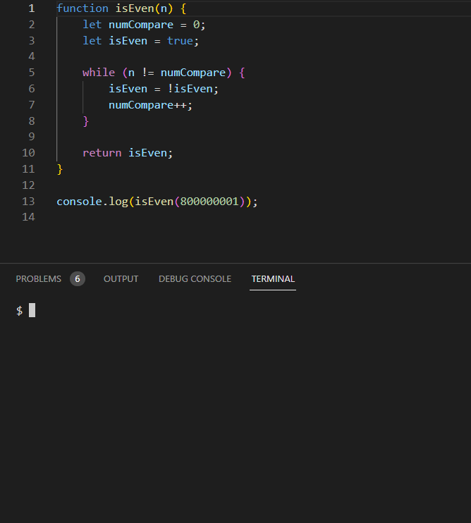

# dash


ECMA-262 implementation in pure Rust. 

## ⚠️ WIP
This is a *WIP* and **not** yet production ready. It is actively being worked on and the API is constantly changing.

## Goals
- Target ECMAScript 2015 and some of the newer features
- Heap/Bytecode snapshot support
- Compatibility
- Easily embeddable into any Rust application
- WebAssembly support
- [JIT](#jit)

## Usage
### Using the CLI
```js
import * as http from '@std/http';

// We already implement Optional Typing, so you can directly annotate parameters and variables with types
// without having to use a third tool such as tsc
function* counter(start: number) {
    let num = start;
    while (true) yield num++;
}

const numbers = counter(0);
const port = 3030;

http.listen(port, (ctx) => {
    const next = numbers.next();
    ctx.respond('Request count: ' + next.value);
});

console.log('Listening on port: ' + port);
```
```sh
# Install Rust
$ curl -sSf https://sh.rustup.rs | sh
# Clone repo
$ git clone https://github.com/y21/dash
# Build cli
$ cd dash/cli && cargo install --path .
# Optional: rename binary to `dashjs`
$ mv ~/.cargo/bin/dash-cli ~/.cargo/bin/dashjs
# Run the program (run with --help for help)
$ dashjs run example.js
```
Now open up your browser, navigate to http://localhost:3030, refresh a bunch of times and see the numbers go up.

### JIT
This engine has very basic support for JIT compilation. It uses LLVM for further optimizations and codegen, based on specialized type information and branches tracked by tracing one iteration of hot loops.

You can enable it by passing the `jit` feature flag to the dash_vm crate. Beware that it's a very early WIP, expect bugs and crashes!



<sub>Running a silly and inefficient `isEven` function on a large number to test the performance of JS engines.</sub>

### Embedding into a Rust application
Note that the API is not stable. Things are constantly changing, so your code may break at any time when bumping the version, which is why it is highly recommended to lock in to a specific revision for now.

- Cargo.toml
```toml
[dependencies]
dash_vm = { git = "https://github.com/y21/dash", features = ["eval"] }
```
> The `eval` feature exposes a convenience `eval()` method on the `Vm` struct
> that lets you specify a JavaScript source string directly.

- main.rs
```rs
use dash_vm::Vm;

fn main() {
    let source = "const x = 42; x * x";

    let mut vm = Vm::new(Default::default());
    let result = vm.eval(source, Default::default()).expect("JS Exception");

    println!("Result: {}", match result {
        Value::Number(n) => n,
        _ => unreachable!()
    });
}
```
<sub>See `dash-cli/` for a more detailed example</sub>
